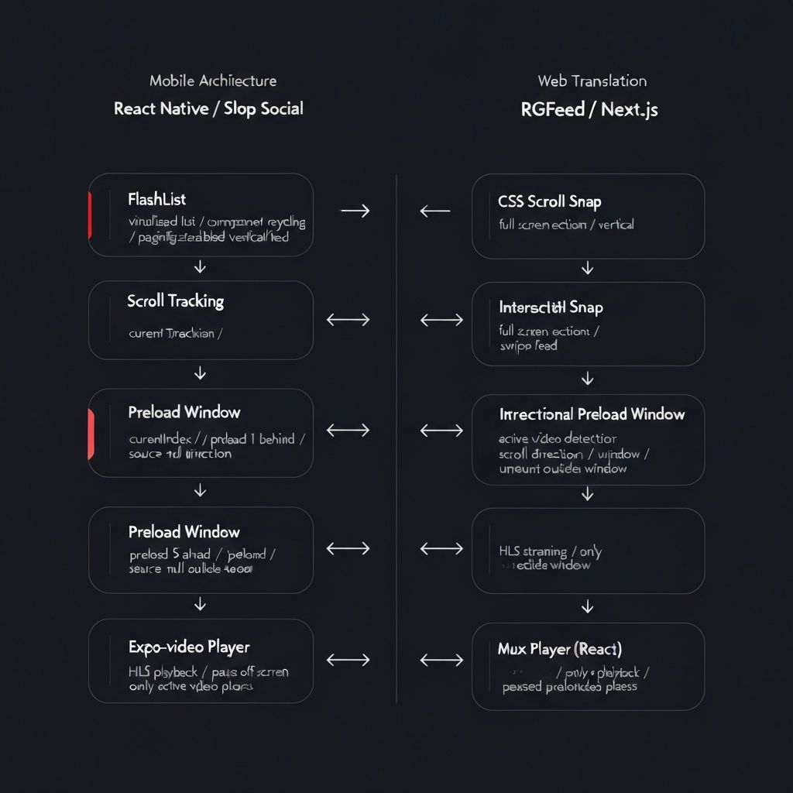

# RGFeed

<a href="https://v0.app/chat/api/kiro/clone/jrguill3n/RGFeed" alt="Open in Kiro"></a>



## Project Overview

RGFeed is a TikTok-style vertical video feed built for the web. It recreates the architecture from Mux's [Slop Social](https://github.com/muxinc/slop-social) React Native demo and translates it into a web implementation using Next.js. The project was built rapidly using [Vercel v0](https://v0.dev).

---

## Architecture Inspiration

The [Mux Slop Social demo](https://github.com/muxinc/slop-social) is a React Native proof-of-concept that demonstrates three core systems for high-performance vertical video feeds:

1. **Virtualized scrolling** — only render what is necessary; mount and unmount players based on proximity to the active item
2. **Directional preloading** — load more videos ahead in the direction the user is scrolling, and fewer behind
3. **Playback control** — only the active video plays; all others are paused and muted

The React Native implementation uses `FlashList` for virtualized rendering and `expo-video` for playback. RGFeed adapts these same concepts for the web platform.

---

## Web Architecture Translation

| React Native (Slop Social) | Web (RGFeed) |
|---|---|
| `FlashList` | CSS Scroll Snap container |
| `expo-video` | `@mux/mux-player-react` |
| `source={null}` for off-screen videos | Conditional player mounting |
| Scroll tracking | `IntersectionObserver` + `scrollTop` delta |

### Preload Window Strategy

- Preload **6 videos ahead** in the current scroll direction (`MAX_AHEAD = 6`)
- Preload **1 video behind** (`MAX_BEHIND = 1`)
- Unmount `MuxPlayer` entirely for items outside the window, replacing them with a lightweight poster image placeholder

### Warmup for Instant First Frame (Web)

Web playback can feel clunky during the thumbnail-to-first-frame transition — the player mounts, HLS segments are requested, the decoder initializes, and only then does the first frame appear. To smooth this over, RGFeed adds a warmup step for all preloaded (non-active) players:

1. `MuxPlayer` stays **mounted** for all items inside the preload window — no remount on activation
2. Once the player fires `loadedmetadata` for the first time, a short prime sequence runs:
   - Call `play()` to kick off segment fetching and decoder initialization
   - After ~120ms call `pause()` to stop actual playback
   - Reset `currentTime = 0` so the active state always starts from the beginning
3. The warmup runs **once per `playbackId` per mounted player** — a `didWarmupRef` flag prevents repeat primes on re-renders
4. The warmup is gated behind `hasInteracted` to satisfy browser autoplay policies

**Why this helps:** calling `play()` even briefly forces the browser to buffer initial segments and warm up the hardware decoder. When the user scrolls to that item and the player becomes active, the first frame is already decoded and ready — eliminating the black-frame flash that otherwise appears between thumbnail and video.

---

## Mux Integration

Videos are pulled dynamically from the Mux Video API via a server-side route:

```
app/api/mux/assets
```

This route:
- Authenticates with Mux using HTTP Basic Auth (`MUX_TOKEN_ID` / `MUX_TOKEN_SECRET`)
- Fetches all assets from `GET /video/v1/assets`
- Filters assets to those with a `public` playback policy
- Returns simplified video objects (playback ID, duration, aspect ratio, creation time)

The client fetches this endpoint on mount to build the feed dynamically.

---

## Features Implemented

- TikTok-style vertical swipe feed
- CSS scroll snap navigation (`scroll-snap-type: y mandatory`)
- Active video detection with `IntersectionObserver` (threshold 0.6)
- Directional video preloading (6 ahead, 1 behind)
- Only active video plays; all others are paused and muted
- Warmup decode for preloaded videos (prime play/pause on `loadedmetadata`)
- Smoother thumbnail-to-playback transition (no black-frame flash on activation)
- Tap to pause / resume
- Double-tap to like with heart burst animation
- Placeholder thumbnails using the Mux image API (`image.mux.com/{playbackId}/thumbnail.jpg`)
- Dynamic video loading from Mux

---

## Why This Exists

The goal of this project is to demonstrate that the performance and UX principles from Slop Social — a mobile-native architecture — can be faithfully adapted to the web. The same three systems (virtualized rendering, directional preloading, exclusive playback) translate cleanly to CSS Scroll Snap, `IntersectionObserver`, and conditional `MuxPlayer` mounting.

---

## Tech Stack

- [Next.js](https://nextjs.org) (App Router)
- [React](https://react.dev)
- [Mux Video API](https://docs.mux.com/api-reference)
- [`@mux/mux-player-react`](https://github.com/muxinc/elements/tree/main/packages/mux-player-react)
- [Tailwind CSS](https://tailwindcss.com)
- `IntersectionObserver`
- CSS Scroll Snap

---

## Running the Project

### Environment Variables

```bash
MUX_TOKEN_ID=your_mux_token_id
MUX_TOKEN_SECRET=your_mux_token_secret
```

These can be added via the **Vars** panel in the v0 sidebar or as environment variables in your Vercel project settings.

> Assets must have **public playback** enabled in Mux for them to appear in the feed.

### Local Development

```bash
pnpm install
pnpm dev
```

---

## Credits

- [Mux Slop Social](https://github.com/muxinc/slop-social) — original React Native architecture
- [Mux Video API](https://docs.mux.com) — video hosting and delivery
- [Vercel v0](https://v0.dev) — used to build this implementation
